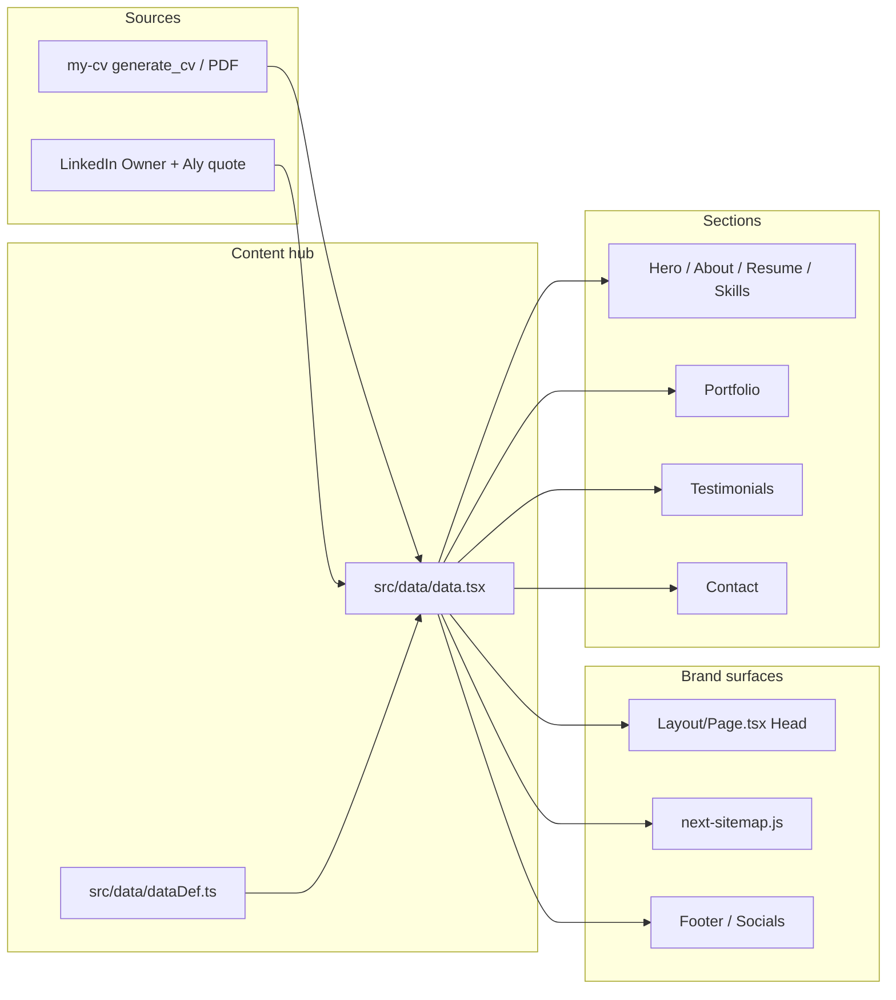

# Personal Site Content Refresh - Plan

## Goal Capsule

- **Objective:** Refresh the personal resume site so public copy, branding, and resume download match Ahmed Alsabbahy’s current dual story (senior engineer + Alsabbahy Technology owner) on **ahmed.alsabbahy.com**.
- **Product authority:** This Product Contract. Content facts come from sibling project `my-cv` (`generate_cv.py` / `Ahmed-Alsabbahy-CV-2026.pdf`) merged with LinkedIn Owner role; site email and domain follow dialogue decisions over CV contact lines when they conflict.
- **Open blockers:** None.

---

## Product Contract

**Product Contract preservation:** unchanged (IDs and intent from brainstorm + 2026-07-14 doc-review; planning assumptions record call-out defaults only).

### Summary

Curated content refresh of the existing personal site for dual audiences (recruiters and clients): engineer-first positioning, accurate concurrent roles, real projects and one real testimonial, 2026 CV download, and full retirement of **sabbahy.codes** in favor of **ahmed.alsabbahy.com** / **ahmed@alsabbahy.com**.

### Problem Frame

The live site still presents LXT as current employment, uses discarded sabbahy.codes branding, and ships template portfolio/testimonials. Parallel truth already exists in `my-cv` (Netguru present, LXT ended Oct 2025, current projects) plus LinkedIn (Alsabbahy Technology Owner concurrent). Visitors and the owner currently reconcile that drift by hand.

### Key Decisions

- **Dual audience, engineer-first hero.** Recruiters and clients both matter; depth leads, Alsabbahy Technology ownership is secondary context.
- **Canonical domain ahmed.alsabbahy.com; sabbahy.codes discarded.** Meta, OG, social copy, and links must not advertise the old domain.
- **Contact email ahmed@alsabbahy.com.** Overrides the Gmail line on the CV for on-site contact only. The downloaded my-cv PDF may retain its generated contact block (including Gmail); that is an intentional exception, not a Site brand failure.
- **Content merge: my-cv + LinkedIn Owner.** Netguru is primary present employment; Alsabbahy Technology Owner is a concurrent ownership role (Apr 2025–Present); timeline and project bullets otherwise follow `my-cv`.
- **Dual-role presentation.** Experience lists Netguru and Alsabbahy Technology Owner as separate timeline entries, both Apr 2025–Present; Netguru is labeled primary employment and Owner is labeled concurrent ownership (not a second undifferentiated primary employer). About Employment lists both with Netguru first.
- **Approach B — curated site.** Intentional rewrite for dual-audience clarity, not a raw dump of every CV bullet. Hero and About positioning prose must be owner-supplied or quoted/derived only from my-cv and the agreed LinkedIn Owner wording — no freestyled seniority, ownership, or brand claims beyond those sources.
- **Portfolio: curated current flagships.** Default subset: ChartiAI, Khuta, ABMFY, Zillog, n8n Lead-Gen (active/founder-shaped). Older CV projects (VORS.AI, iCarica) stay out of the featured grid unless planning finds assets/story that earn a slot. Each card uses a real project destination or no outbound URL; template/demo hosts are prohibited.
- **Testimonials: Aly Abdelrahman only, gated.** Drop template John/Jane Doe entries. Ship only after republication use of Aly’s LinkedIn recommendation is confirmed; if confirmation fails, omit the Testimonials section entirely (do not reinstate placeholders).
- **Resume download: Ahmed-Alsabbahy-CV-2026.pdf from my-cv.** Replaces the existing resume asset backing the Resume CTA. PDF content matches the my-cv general CV, including its contact lines.
- **No public phone number on the site.** Email, Calendly (if kept), and socials remain the reach paths.
- **Interim Contact UX.** Until contact-form backend ships, Contact’s working primary action is `mailto:ahmed@alsabbahy.com` (plus listed socials). Disable or remove the Send Message form so it cannot present a fake submit path.
- **Hero CTAs.** Resume remains available; Calendly meeting link appears only if the existing URL is confirmed live; Contact remains an in-page path.

### Actors

- A1. Recruiter / hiring manager — scans for seniority, stack, recent employers, resume download.
- A2. Prospective client — scans for ownership, shipped products, credibility signals, contact path.
- A3. Site owner (Ahmed) — wants one canonical public face that matches current reality without inventing claims.

### Key Flows

- F1. First-visit identity — Land on hero; read engineer-first positioning with secondary ownership; choose Resume, Contact, and a Calendly meeting link only if the existing URL is still valid (per Dependencies).
- F2. Credibility deep-dive — Skim About → Experience (Netguru primary Present, Alsabbahy Technology Owner concurrent, LXT closed) → curated Portfolio → Aly testimonial (if shipped) → Contact.
- F3. Brand hygiene — Any share/meta/footer path shows ahmed.alsabbahy.com identity; no sabbahy.codes string remains in user-facing content.

### Requirements

**Identity and branding**

- R1. Hero and About present an engineer-first dual brand suitable for both A1 and A2, with Alsabbahy Technology ownership visible but not leading. Positioning prose is owner-supplied or derived only from my-cv and agreed LinkedIn Owner wording (no freestyle claims beyond those sources).
- R2. All user-facing branding, meta, OG, Twitter cards, and links retire sabbahy.codes; canonical public domain is ahmed.alsabbahy.com.
- R3. Public contact email on the site is ahmed@alsabbahy.com.

**Experience and content truth**

- R4. Experience shows Netguru (Apr 2025–Present) as primary present employment and LXT as ended (through Oct 2025), with bullets aligned to my-cv.
- R5. Experience includes Alsabbahy Technology Owner as its own Work timeline entry (Apr 2025–Present), labeled concurrent ownership (not a second primary employer Present). About Employment lists both roles with Netguru first and Owner second.
- R6. Earlier roles (Sword, Amjaad, Symbios, Override) stay truthful to my-cv; no LXT-“Present” language remains anywhere.
- R12. Skills groups and items stay truthful to my-cv where the live Skills section drifts; no invented skills or levels.

**Portfolio, social proof, resume**

- R7. Portfolio features only real curated projects from my-cv (default: ChartiAI, Khuta, ABMFY, Zillog, n8n Lead-Gen); no template “Project title N” placeholders. Each featured card links to a real project destination or has no outbound URL; template/demo hosts are prohibited as user-facing destinations.
- R8. If Aly Abdelrahman’s LinkedIn recommendation is confirmed usable for website republication, Testimonials contains that quote only and no fake placeholders. If confirmation fails, omit the Testimonials section entirely.
- R9. Resume CTA downloads Ahmed-Alsabbahy-CV-2026.pdf (content sourced from my-cv, including the CV’s generated contact block).

**Hygiene and contact**

- R10. Phone number from the CV is not published on the site.
- R11. No invented employers, titles, dates, or project claims beyond my-cv + the agreed LinkedIn Owner merge.
- R13. Until contact-form email backend ships, Contact’s working primary action is mailto:ahmed@alsabbahy.com (plus listed socials); the Send Message form is disabled or removed so it cannot present a fake submit success path.

### Acceptance Examples

- AE1. When a visitor opens the hero, they see senior-engineer positioning first and Alsabbahy Technology as secondary context — not an LXT-present claim. (R1, R4, R6)
- AE2. When a visitor searches page source and visible copy for `sabbahy.codes`, there are zero matches; domain/meta point at ahmed.alsabbahy.com. (R2)
- AE3. When a visitor opens Contact, the email target is ahmed@alsabbahy.com, no phone number is shown, and the primary working action is mailto (not a fake form submit). (R3, R10, R13)
- AE4. When a visitor reads Experience, Netguru is labeled primary Present employment, Alsabbahy Technology Owner appears as a concurrent ownership entry from Apr 2025, and LXT ends Oct 2025. About Employment lists Netguru then Owner. (R4, R5)
- AE5. When a visitor opens Portfolio, every card is a named real project from the curated set with non-template copy, and outbound links are either real destinations or absent — never template/demo hosts. (R7)
- AE6. When Testimonials ships, a visitor sees Aly Abdelrahman’s quote only; if republication is not confirmed, the section is absent rather than filled with placeholders. (R8)
- AE7. When a visitor clicks Resume, they receive the 2026 CV PDF whose content matches my-cv’s general CV (including CV contact lines, which may differ from on-site R3). (R9)
- AE8. When a visitor skims Skills, the stack matches my-cv with no invented skills or levels. (R12)

### Success Criteria

- A cold reader cannot detect leftover template filler in Portfolio or Testimonials (or a missing Testimonials section after a failed Aly confirmation).
- Site facts do not contradict my-cv on employment dates/titles, except where this Contract explicitly adds Alsabbahy Technology Owner.
- User-facing meta, OG, footer, social copy, and contact consistently use ahmed.alsabbahy.com / ahmed@alsabbahy.com with no sabbahy.codes; in-repo meta/sitemap updates ship with this work (U5); live DNS/host cutover stays deferred under Scope Boundaries.
- On-site contact brand (R3/R10) is not judged failed solely because the downloaded my-cv PDF still carries Gmail/phone.

### Scope Boundaries

**In scope**

- Curated copy updates across hero, about, experience, skills (where drifted), portfolio, testimonials (if gated), contact (including interim mailto UX), socials, page meta.
- Replace resume download asset with Ahmed-Alsabbahy-CV-2026.pdf from my-cv.
- Remove sabbahy.codes from user-facing surfaces.
- Small component/type changes required for optional portfolio URLs, Contact without fake form, and Header nav when Testimonials is omitted.

**Deferred for later**

- Visual redesign, motion overhaul, new section layouts.
- Contact-form email backend / SendGrid wiring.
- Framework or dependency upgrades.
- Automating sync from my-cv → site (one-time curated port for this ship).
- Publishing VORS.AI / iCarica (or other older projects) if assets and copy are prepared later.
- Regenerating my-cv PDF contact to ahmed@alsabbahy.com (sibling project; optional follow-up).
- Live DNS/host cutover for ahmed.alsabbahy.com beyond in-repo meta/sitemap.

**Out of scope**

- Changing career facts that are not in my-cv or the agreed Owner merge.
- Building a new site product or CMS.

### Dependencies / Assumptions

- Sibling project `my-cv` remains the factual authority for jobs, projects, skills, and the 2026 PDF (`generate_cv.py`, `Ahmed-Alsabbahy-CV-2026.pdf`).
- Aly Abdelrahman LinkedIn recommendation republication for the site must be confirmed before Testimonials ships; otherwise omit the section.
- Calendly link may remain only if still valid; planning confirms live URL without inventing a new booking product.
- Brand/canonical surfaces may also live outside `src/data/data.tsx` (e.g. layout Head, sitemap); planning inventories those touchpoints under R2/AE2.

### Outstanding Questions

**Deferred (non-blocking)**

- Exact public URLs per portfolio project when a live destination is unavailable (null URL path is allowed).
- Whether Instagram / Twitter handles need rename vs removal when scrubbing old brand strings (prefer remove or retarget off sabbahy.codes).
- Optional later: regenerate my-cv PDF contact to ahmed@alsabbahy.com.

---

## Planning Contract

### Assumptions

- Aly testimonial ships with the public LinkedIn recommendation wording (republication assumed OK for this ship). If the implementer cannot obtain the quote text, omit Testimonials and drop its nav entry (R8).
- Portfolio cards remap existing `src/images/portfolio/*` stock images to the five curated projects for this ship; real project screenshots deferred.
- Keep existing Calendly Schedule CTA if the current URL responds; otherwise remove that hero action only.
- Resume delivery: overwrite `public/assets/resume.pdf` with bytes from sibling `my-cv/Ahmed-Alsabbahy-CV-2026.pdf`; keep hero href `/assets/resume.pdf`.
- Instagram/Twitter: remove or retarget any `sabbahy.codes` handles; do not invent new handles.
- In-repo meta/sitemap for ahmed.alsabbahy.com is sufficient for this ship; live DNS is follow-up.
- Repo has no unit-test harness; verification is lint/compile + runtime smoke against AEs.

### Key Technical Decisions

- **KTD1. Keep the data-driven content hub.** Almost all copy stays in `src/data/data.tsx` / `dataDef.ts`. Section components stay thin. Rationale: matches existing architecture; Product Contract is content-shaped.
- **KTD2. Brand scrub is multi-surface.** R2/AE2 require edits beyond `data.tsx`: `Page.tsx` (canonical/og:url still hardcode reactresume.com), `next-sitemap.js` (`sabbahy.codes`), Footer template credit, and social/contact strings. Wire `homePageMeta` into Head where fields are currently dead.
- **KTD3. Optional portfolio URL.** Change `PortfolioItem.url` to optional; `Portfolio` skips outbound link/icon when absent. Avoids template-host placeholders while allowing projects without a public URL.
- **KTD4. Testimonials + Header couple.** Empty `testimonials` already returns null; also remove `SectionId.Testimonials` from Header nav when empty so F2/nav stay coherent.
- **KTD5. Contact interim = remove form UI.** Do not leave a submit button that console.logs. Left column can point visitors to mailto contact items (R13).
- **KTD6. Dual-role labels as content, not schema.** Encode “Primary employment” / “Concurrent ownership” in Experience `title`/`location`/`content` and About Employment text — no new Timeline fields.
- **KTD7. Smoke-first verification.** No test runner in repo; each feature-bearing unit carries runtime smoke scenarios, not Jest/Playwright scaffolding.

### High-Level Technical Design

Content authority flows into the hub; brand surfaces that bypass the hub today must be brought into the same domain/email rules.

### Sequencing

U1 → U2 → U3 → U4 / U5 in parallel after U1 → U6 last for asset + end-to-end smoke.

---

## Implementation Units

### U1. Personal content hub (hero, about, skills, experience, contact items, socials, meta)

**Goal:** Make `data.tsx` reflect my-cv + Owner merge with engineer-first dual brand and on-site contact/brand strings.

**Requirements:** R1, R3, R4, R5, R6, R10, R11, R12; A1/A2; AE1, AE4, AE8

**Dependencies:** None

**Files:**
- Modify: `src/data/data.tsx`
- Modify: `src/data/dataDef.ts` (only if meta fields need tightening)
- Reference (read-only): sibling `my-cv/generate_cv.py`, `my-cv/Ahmed-Alsabbahy-CV-2026.pdf`

**Approach:**
- Hero: Senior Backend Engineer / distributed systems framing from my-cv headline; Alsabbahy Technology secondary; Netguru as current employer context; keep Resume CTA; keep Calendly only if URL live (else drop).
- About: rewrite from my-cv summary + Owner concurrent; Employment lists Netguru then Owner.
- Skills: align groups to my-cv skill rows (levels may stay qualitative bars consistent with existing UI).
- Experience: Netguru primary Present; Owner concurrent Present; LXT ends Oct 2025; earlier roles from my-cv.
- Contact items: email ahmed@alsabbahy.com; no phone; fix location/social hrefs away from sabbahy.codes.
- Socials: scrub sabbahy.codes; keep GitHub/LinkedIn/StackOverflow when still valid.
- `homePageMeta`: title/description/og/twitter for Ahmed Alsabbahy / ahmed.alsabbahy.com — no sabbahy.codes.

**Patterns to follow:** Existing JSX-in-data for hero/experience; `aboutItems` icon rows.

**Test scenarios:**
- Happy: hero + about read engineer-first with Owner secondary; no LXT-Present. (Covers AE1)
- Happy: Experience shows Netguru primary Present, Owner concurrent, LXT ended. (Covers AE4)
- Happy: Skills skim matches my-cv stacks. (Covers AE8)
- Edge: no phone contact item remains. (R10)
- Error: grepping `data.tsx` for `sabbahy.codes` returns none for contact/social/meta strings after this unit (partial R2 until U5).

**Verification:** Compile-clean `data.tsx`; visual scan of Hero/About/Resume/Skills in `yarn dev`.

**Execution note:** Prefer runtime smoke over unit coverage — no test harness in repo.

---

### U2. Portfolio optional URL + curated projects

**Goal:** Ship five curated real projects with no template titles/hosts; support missing outbound URLs.

**Requirements:** R7, R11; AE5

**Dependencies:** U1 (shared data file sequencing; may land same PR as U1 if careful)

**Files:**
- Modify: `src/data/dataDef.ts` (`PortfolioItem.url` optional)
- Modify: `src/components/Sections/Portfolio.tsx` (skip `<a>` / external icon when no url)
- Modify: `src/data/data.tsx` (replace `portfolioItems`)
- Modify: `src/images/portfolio/` imports only as needed (remap existing assets)

**Approach:**
- Cards: ChartiAI, Khuta, ABMFY, Zillog, n8n Lead-Gen — titles/descriptions derived from my-cv PROJECTS; urls real or omitted.
- Remap existing portfolio images 1–5 (or any five) to cards; no new art required.
- Remove remaining template items and unused image imports.

**Patterns to follow:** Existing masonry + overlay; extend for non-link tiles.

**Test scenarios:**
- Happy: Portfolio shows exactly the curated named projects with non-template copy. (Covers AE5)
- Happy: cards with urls open real destinations; no reactresume.com. (Covers AE5)
- Edge: a card without url still renders image/title/description without a broken external affordance.
- Error: template titles “Project title N” absent from the section.

**Verification:** Portfolio section in browser; spot-check outbound hrefs.

---

### U3. Testimonials (Aly) + Header nav sync

**Goal:** Single Aly recommendation or omit section cleanly including nav.

**Requirements:** R8; AE6; F2

**Dependencies:** U1

**Files:**
- Modify: `src/data/data.tsx` (`testimonial`)
- Modify: `src/components/Sections/Header.tsx` (nav omits Testimonials when empty)
- Optionally modify: `src/pages/index.tsx` only if needed for consistent section order (prefer data/Header only)

**Approach:**
- Default: one testimonial — Aly Abdelrahman quote from public LinkedIn recommendation text; avatar optional.
- If quote unavailable at implement time: `testimonials: []` and Header removes Testimonials link.
- Do not reintroduce John/Jane Doe placeholders.

**Patterns to follow:** Existing `if (!testimonials.length) return null` in Testimonials.

**Test scenarios:**
- Happy: Testimonials shows only Aly’s quote. (Covers AE6)
- Edge: empty testimonials → section absent and Header has no Testimonials entry.
- Error: no placeholder Doe copy remains.

**Verification:** Toggle empty vs filled testimonials in data and confirm nav + section behavior in browser.

---

### U4. Contact interim UX (mailto primary; no fake form)

**Goal:** Visitors can email via mailto; Send Message form cannot fake success.

**Requirements:** R3, R10, R13; AE3; F1

**Dependencies:** U1 (contact items)

**Files:**
- Modify: `src/components/Sections/Contact/index.tsx` (stop mounting form / show mailto-forwarding UI)
- Modify or leave unused: `src/components/Sections/Contact/ContactForm.tsx` (remove unused import path; delete file only if nothing else imports it)

**Approach:**
- Remove or hide `ContactForm` from the Contact section layout.
- Keep contact items list with mailto as the primary working action.
- Optional short prose pointing to email/socials (no phone).

**Patterns to follow:** Contact items already support `mailto:` via `ContactType.Email`.

**Test scenarios:**
- Happy: Contact email is ahmed@alsabbahy.com and triggers mailto. (Covers AE3)
- Happy: no Send Message submit UI present.
- Edge: no phone listed. (R10)

**Verification:** Contact section in browser; confirm no form submit control.

---

### U5. Brand surfaces outside data hub

**Goal:** Canonical/OG/sitemap/footer no longer advertise sabbahy.codes or reactresume template identity.

**Requirements:** R2; AE2; F3

**Dependencies:** U1 (meta content ready)

**Files:**
- Modify: `src/components/Layout/Page.tsx` (canonical + og:url from `homePageMeta` / ahmed.alsabbahy.com; render useful OG fields)
- Modify: `next-sitemap.js` (`siteUrl` → `https://ahmed.alsabbahy.com`)
- Modify: `src/components/Sections/Footer.tsx` (remove or neutralize reactresume credit / sabbahy.codes)
- Modify: `public/site.webmanifest` if short name still implies discarded brand
- Optional: `package.json` `name` field (non-user-facing; low priority)

**Approach:**
- Stop hardcoding `https://reactresume.com` for canonical/og:url.
- Prefer absolute URLs under `https://ahmed.alsabbahy.com`.
- Confirm after edit: repo search for `sabbahy.codes` and `reactresume.com` in user-facing src/public config is empty (or only deferred docs).

**Patterns to follow:** Existing `Page` Head component; prefer wiring declared `HomepageMeta` fields rather than new prop sprawl.

**Test scenarios:**
- Happy: View page source — canonical/og:url point at ahmed.alsabbahy.com; no sabbahy.codes. (Covers AE2)
- Happy: sitemap config siteUrl updated.
- Edge: Footer no longer pushes visitors to reactresume.com as identity.
- Integration: full-text search of src + next-sitemap + public for `sabbahy.codes` yields zero user-facing hits.

**Verification:** `yarn build` (or `yarn sitemap` if used in deploy) + source inspection of rendered Head.

---

### U6. Resume PDF asset swap

**Goal:** Resume CTA serves Ahmed-Alsabbahy-CV-2026.pdf content.

**Requirements:** R9; AE7

**Dependencies:** None (can parallel early; smoke after U1 hero CTA exists)

**Files:**
- Modify/replace: `public/assets/resume.pdf` (bytes from sibling `my-cv/Ahmed-Alsabbahy-CV-2026.pdf`)
- Touch: `src/data/data.tsx` only if href must change (prefer keep `/assets/resume.pdf`)

**Approach:** Copy PDF bytes into `public/assets/resume.pdf`. Do not rewrite CV contact inside this repo.

**Test scenarios:**
- Happy: clicking Resume downloads/opens PDF whose body matches my-cv 2026 general CV. (Covers AE7)
- Edge: on-site email remains ahmed@alsabbahy.com even if PDF lists Gmail.

**Verification:** Download via hero CTA in browser; spot-check PDF text (name, Netguru, date range).

**Execution note:** This is packaging/asset work; smoke verification over unit tests.

---

## Verification Contract

| Gate | Applies | Done signal |
|------|---------|-------------|
| Typecheck/compile | All units | `yarn compile` succeeds |
| Lint | Touched TS/TSX | `yarn lint` clean (or project’s accepted lint path) |
| Dev smoke | U1–U6 | `yarn dev` — walk AE1–AE8 visually |
| Brand grep | U5 (+U1) | No `sabbahy.codes` in user-facing src/config; no template `reactresume.com` identity in Head/Footer |
| Resume asset | U6 | `/assets/resume.pdf` opens 2026 CV |
| Build | Before merge | `yarn build` succeeds |

Unit-level test scenarios above are manual smoke checks (repo has no test runner). Do not invent a Jest/Playwright suite in this plan.

---

## Definition of Done

- Product Contract R1–R13 and AE1–AE8 satisfied by implemented behavior (or R8 omit path documented in PR).
- All Implementation Units U1–U6 complete with their verification outcomes.
- Verification Contract gates pass.
- No template portfolio/testimonial filler remains.
- Landing strategy: open a PR when ready; user preference overrides.

---

## Risks & Dependencies

| Risk | Mitigation |
|------|------------|
| Aly quote source unavailable | Omit Testimonials + Header link (R8) |
| Calendly URL dead | Drop Schedule CTA only |
| Dead social handles after scrub | Prefer remove over inventing replacements |
| Portfolio without real URLs looks incomplete | Optional url + strong titles/descriptions from my-cv |
| `Page.tsx` meta left stale | Dedicated U5; AE2 source check |
| Content drift vs my-cv later | Deferred automation; one-time port only |

**External dependency:** Read access to sibling `my-cv` for PDF + `generate_cv.py` wording.

---

## System-Wide Impact

- End users (A1/A2): accurate identity, contact, resume.
- Implementer: primarily data + small UI seams; no backend.
- Ops/SEO: sitemap domain change; live DNS still follow-up.

---

## Sources & Research

- Product Contract above (ce-brainstorm + doc-review).
- Repo patterns: `src/data/data.tsx`, `Page.tsx`, `next-sitemap.js`, Contact/Testimonials/Portfolio sections.
- Sibling `my-cv` (July 2026 general CV).
- No `docs/solutions/` institutional learnings.

---

## Deferred / Open Questions

### From 2026-07-14 review

- **Optional CV contact realignment in my-cv** — R9 / sibling my-cv (P1, product-lens/adversarial, confidence 75)

  A later follow-up may regenerate Ahmed-Alsabbahy-CV-2026.pdf so its contact block uses ahmed@alsabbahy.com. Not required for this ship; on-site R3 and PDF AE7 carve-out remain authoritative until then.
